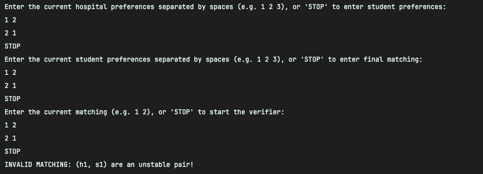
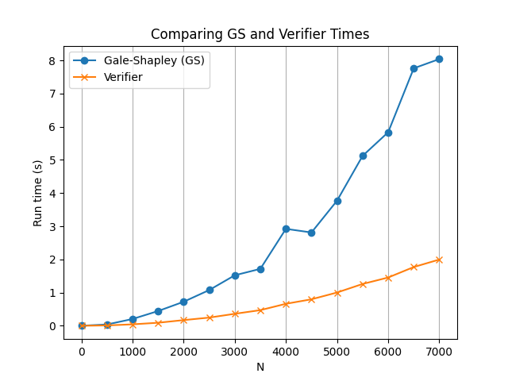

# COP4533-Gale-Shapley

Group Members:
- Tom Shal-bar, 36397041
- Thomas Tavera, 38874789

# Run instructions:
1) Clone repo

```git clone https://github.com/tomshalbar/COP4533-Gale-Shapley.git```

2) cd to COP4533-Gale-Shapley root path

```cd COP4533-Gale-Shapley```

3) Create the Python Virtual Environment (venv)

```python3 -m venv .venv```

4) Install requirements from requirements.txt

```pip install -r requirements.txt```

5) To run Gale-Shapley (and by extension the automatic verifier):

```python -m src.main --filename input_files/example_2.in```

- The output for this specific input file would be in `output_files/example_2.out`

6) To run speed_tester (program that produced chart in Task C):

```python -m tests.test_speed --number=5```

- The file is saved as `results.png`

7) To run the Pytest Testing Suite:

```pytest tests/test_gale_shapley.py```

- This contains some unit tests checking both the Gale-Shapley Algorithm and the Verification algorithm

8) Lastly, to run the verifier manually:

```python -m src.main --v```

Here is an example screenshot:



# Task C

The running time of the G-S algorithm seems to increase exponentially with the size of the input. This makes sense, since the worst case run time of the algorithm is $O(n^2)$. The verifier worst time case is also $O(n^2)$; however, it is much faster than the algorithm itself since it primarily features read only operations. The G-S algorithm does a lot of dictionary updates and contains more logic inside its loop, as a result, it runs much slower compared to the verifier.    

