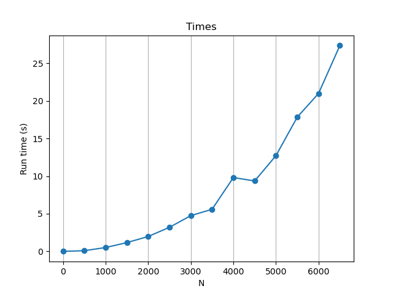

# COP4533-Gale-Shapley

Group Members:
- Tom Shal-bar, 36397041
- Thomas Tavera

# Run instructions:
1) Clone repo
2) Install requirements from requirements.tx

```pip install -r requirements.txt```

3) cd to COP4533-Gale-Shapley root path
4) To run Gale-Shapley:

```python -m src.main.py input_files/example.in```

5) To run speed_tester:

```python src/main.py input_files/example.in```

# Task C

The running time of the G-S algorithem seems to increase exponantially with the size of the input. This makes sense, since the worst case run time of the algorithem is O(n^2).

